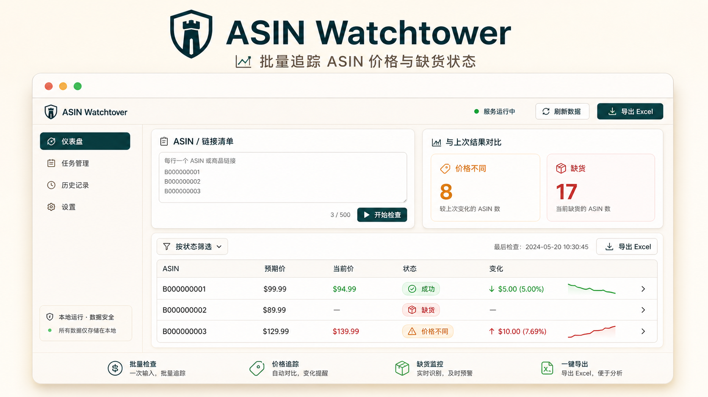

# ASIN Watchtower

**A local Amazon ASIN price and availability monitor for marketplace operators.**

[](LICENSE)




ASIN Watchtower helps marketplace teams batch-check Amazon ASINs, compare expected price with current price, detect unavailable listings, and review changes from the previous run in one local dashboard.

It is designed for operators who manage Amazon listings every day and need a faster way to answer: **Did the price change? Is this ASIN still sellable? Which products need attention first?**

## Start Here

- New user: follow [`Quick Start`](#quick-start).
- Want to test the import shape: open [`examples/sample-asins.csv`](examples/sample-asins.csv).
- Want to understand future direction: read [`docs/ROADMAP.md`](docs/ROADMAP.md).
- Want to contribute safely: read [`CONTRIBUTING.md`](CONTRIBUTING.md) and [`SECURITY.md`](SECURITY.md).

## Contents

- [What It Helps You Catch](#what-it-helps-you-catch)
- [Core Workflow](#core-workflow)
- [Features](#features)
- [Quick Start](#quick-start)
- [Example Input](#example-input)
- [Privacy And Data](#privacy-and-data)
- [Roadmap](#roadmap)
- [Contributing](#contributing)

## What It Helps You Catch

| Signal | What it means |
| --- | --- |
| Price changed | Current Amazon price is different from the expected price or previous run. |
| Out of stock | The target ASIN appears unavailable or redirects to a different ASIN. |
| Missing offer | Amazon shows no featured offer or no usable price. |
| Seller changed | The current seller is different from the expected seller context. |
| Low stock hint | Amazon shows a limited-stock message such as only a few units left. |
| ERP inventory risk | Optional local ERP import can classify stock risk beside Amazon status. |

## Core Workflow

1. Paste ASINs or Amazon product links into the dashboard.
2. Add optional store-link names, ERP SKUs, and expected prices.
3. Start a batch check from the local web interface.
4. Review current price, availability, seller, status, and change indicators.
5. Filter by status, compare with the previous run, and export results to Excel.

## Features

- Batch input for ASINs and product links.
- Expected price vs current price comparison.
- Availability and redirect mismatch detection.
- Status filters for successful, abnormal, failed, out-of-stock, and price-different results.
- Previous-run comparison for changed, new, and missing ASINs.
- Seller, brand, title, store-link name, and ERP SKU display.
- Optional ERP inventory import and SKU mapping import from Excel.
- Excel export for analysis and team follow-up.

## Product Positioning

**For Amazon operators and marketplace teams**, ASIN Watchtower is a local monitoring workspace that turns repetitive ASIN checks into a reviewable, filterable, and exportable workflow.

Unlike one-off scraping scripts, it provides a product-style dashboard, local history comparison, Excel export, and operational risk classification in one place.

## Local-First By Design

This project runs on your own machine. Inventory files, ERP settings, runtime cache, and exported results are intentionally kept out of the repository.

That makes it easier to adapt the tool to private workflows without publishing sensitive operational data.

## Privacy And Data

This repository is source-code only. Do not commit operational data.

Ignored local data includes:

- ERP inventory files: `.xlsx`, `.xls`, `.csv`
- Runtime caches: `erp_inventory_cache.json`, `sku_map_cache.json`, `last_results_cache.json`, `erp_auto_config.json`
- ERP downloads and debug files
- Build outputs: `build/`, `dist/`, `.exe`, `.zip`
- Python caches and virtual environments

ERP URLs, accounts, passwords, tokens, cookies, and inventory data should stay on each user's machine.

## Quick Start

```powershell
python -m venv .venv
.\.venv\Scripts\Activate.ps1
pip install -r requirements.txt
python app.py --port 8080
```

Then open:

```text
http://127.0.0.1:8080
```

## Example Input

See [`examples/sample-asins.csv`](examples/sample-asins.csv) for a public-safe template.

The dashboard expects rows shaped like this:

| ASIN or URL | Store-link name | ERP SKU | Expected price |
| --- | --- | --- | --- |
| `B000000001` | `Demo-Store-A` | `T-DEMO-001-BK` | `99.99` |

For Excel import, open the sample CSV in a spreadsheet editor and save it as `.xlsx`.

## Optional ERP Configuration

Copy `.env.example` to `.env` for local-only settings.

```powershell
Copy-Item .env.example .env
```

Fill in your own ERP URLs and credentials in the dashboard or local environment. Never commit `.env`.

## Roadmap

- Cleaner public demo dataset with fake ASIN/SKU examples.
- Optional chat alert integrations.
- Scheduled monitoring runs.
- Better anti-redirect evidence and screenshots for unavailable ASINs.
- Docker packaging for server deployment.

See [`docs/ROADMAP.md`](docs/ROADMAP.md) for the fuller product direction.

## Contributing

Issues and pull requests are welcome. Please read [`CONTRIBUTING.md`](CONTRIBUTING.md) before sharing bug reports, screenshots, or sample files.

Use fake or public-safe examples whenever possible. Do not post ERP credentials, cookies, private inventory files, internal URLs, or business-sensitive exports.

For security or sensitive-data concerns, see [`SECURITY.md`](SECURITY.md).

## Build Windows App

```powershell
python -m PyInstaller --clean -y AmazonASINDashboard.spec
```

The build output will be generated under `dist/`.

## GitHub Safety Checklist

Before publishing:

```powershell
git status --short --ignored
git ls-files
```

Only source files, templates, static assets, docs, and sample config should be tracked.
